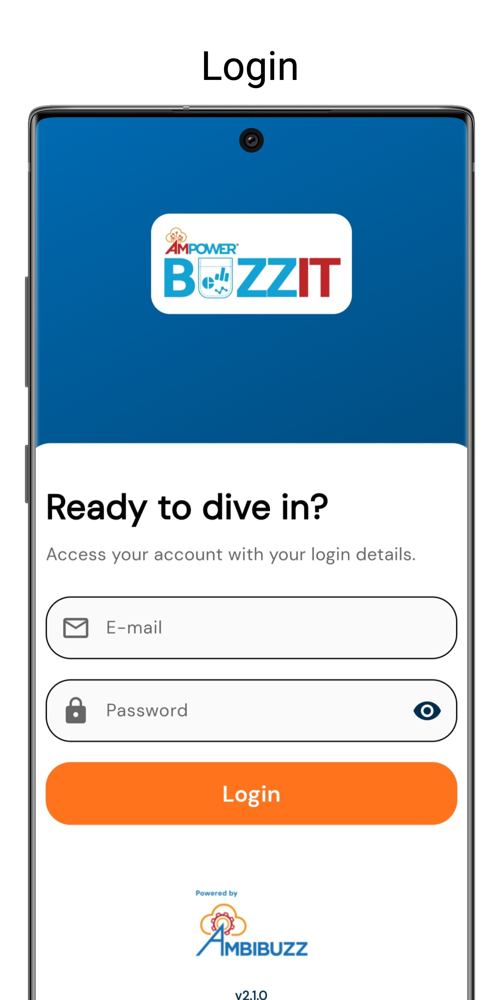
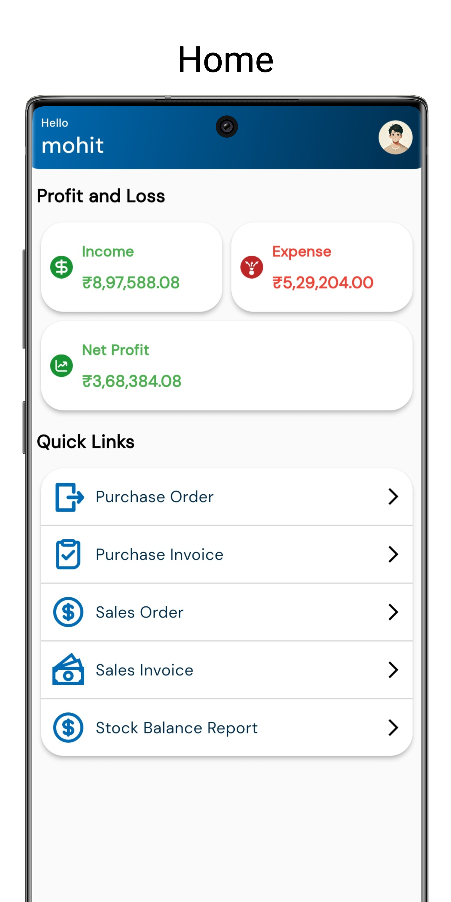
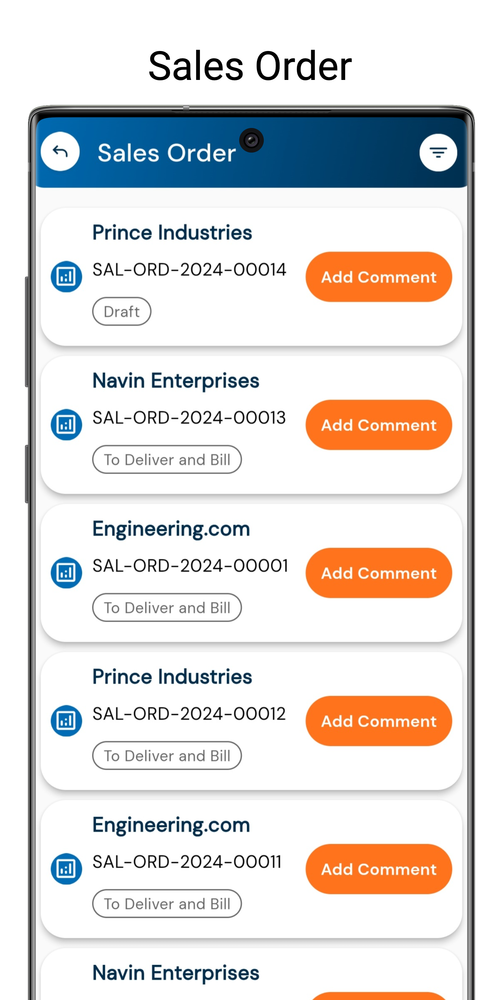

## AmPower BuzzIT
AmPower BuzzIT is a mobile app made with Flutter. With this app business owners,managers and key personel would be able to access crucial data on the go in the form of reports, dashboard.

### Why AmPower BuzzIT?

AmPower BuzzIT is the go-to mobile app for business owners, managers, and key personnel who need instant access to critical business insights. Developed with Flutter, it ensures a seamless experience across devices. Here's why AmPower BuzzIT is essential for your business:

- **Access Crucial Data Anytime, Anywhere**: Stay informed with key metrics and insights available at your fingertips, no matter where you are.
- **Interactive Dashboards**: Visualize your business performance with intuitive, real-time dashboards that make data interpretation effortless.
- **Comprehensive Reports on the Go**: Generate and review detailed reports to support decision-making, even while on the move.
- **Cross-Platform Performance**: Built with Flutter, BuzzIT offers a smooth and consistent experience across all devices.
- **Empower Decision Makers**: Equip business leaders with the tools they need to stay ahead in a fast-paced environment.

### Requirements
- **Flutter** : 3.24.2
- **ERPNext** : v15.39.3

### Tech Stack
- Frontend: Flutter
- Backend: ERPNext

### State Management Pattern
- MVVM

### Screenshots

<kbd></kbd>
<kbd></kbd>
<kbd></kbd>

### Gif


### Features of AmPower BuzzIT
- Dashboard which will show income,expense and net profit
- Can view Sales Order, Sales Invoice, Purchase Invoice, Purchase Order, Items
- Reports : Balance Sheet, Customer Ledger, Supplier Ledger

### To run code
Clone the source code<br/>
```sh
git clone https://github.com/Ambibuzz/ampower_buzzit_mobile.git
```
Then go to cloned directory and open project on android studio or vscode<br/>
Then checkout to ebuzz branch from terminal window of editor<br/>
```sh
git checkout master
```
For installing packages<br/>
```sh
flutter pub get
```
To run the project<br/>
```sh
flutter run
```

### To deploy
Change versions in Pubspec.yaml of project.(Both version and Subversion)
```sh
version: 2.0.0+1
```
#### Android
For Building Apk
```sh
flutter build apk --release
```


#### Ios
For Building Ipa
```sh
flutter build ipa --no-tree-shake-icons
```


### License
MIT